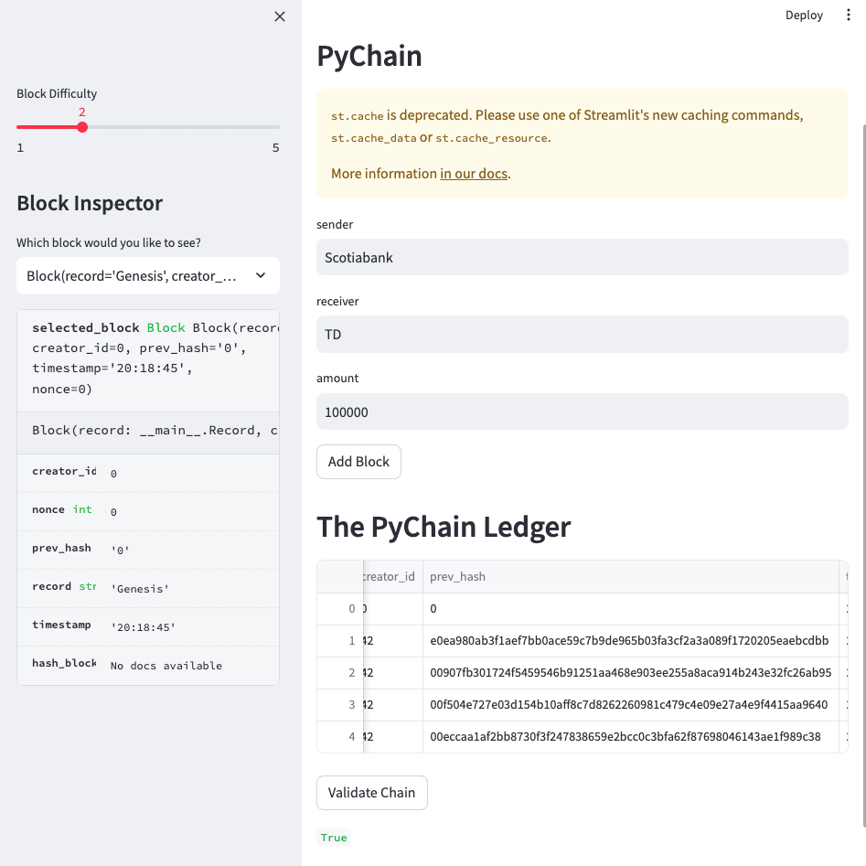
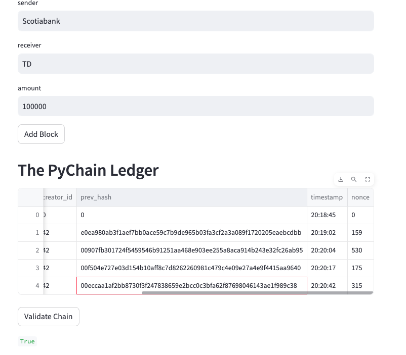

### PyChain Ledger

#### Background:

Is to build a user friendly web inferface blockchain based ledger. This ledger will allow partner banks to conduct finanical transactions and to verify the interity of the data in the ledger.

#### Overview:
- Create a new data class named Record.
- Modify the existing Block data class to store Record data.
- Add Relevant User Inputs to the Streamlit interface.
- Test the PyChain Ledger by Storing Records.

#### Files:
You will find the relative work in pychain.py.

#### Storing Records:

##### Testing the Functionality of the Blockchain

##### Vaildating the Blockchain

